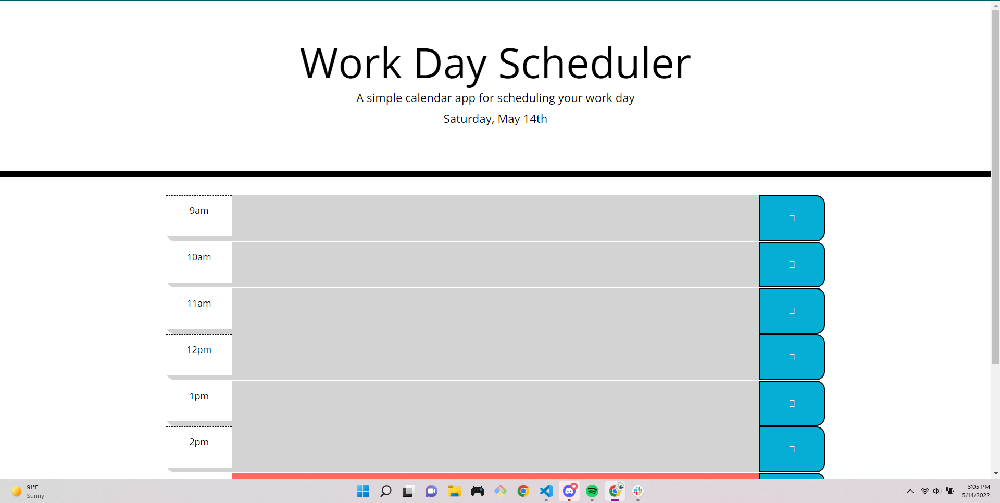
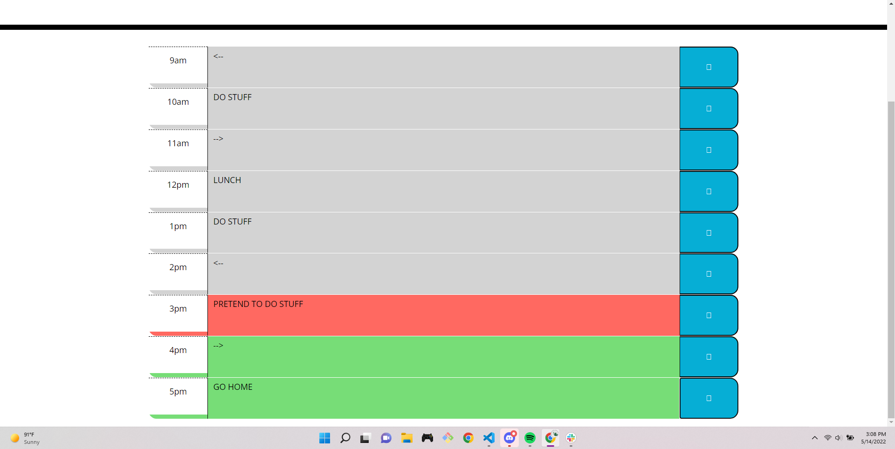

# Work Day Scheduler Starter Code

## Description

Help organize the work day by setting daily tasks in your timeblocks. Simply enter your task in the relative time slot and lock it in with the button to the right.
Timeblocks are color coded depending on time status.
- green (future)
- red (present)
- grey (past)

#### Dedployed at:

[https://millerchase.github.io/work-day-scheduler/](https://millerchase.github.io/work-day-scheduler/)

## Screen Shots

## Made with:

* HTML
* CSS
* Bootstrap
* JavaScript
* jQuerry
* Moment.js

## Contributors
Made with ❤️ by Chase Miller.

